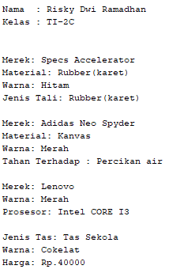

Kode program leptop

public class leptop {    
    private String merek,warna,prosesor;
    
    public void setMerek(String newValue){
        merek = newValue;
    }    
    
    public void setWarna(String newValue){
        warna = newValue;
    }       
    
    public void setProsesor(String newValue){
        prosesor = newValue;
    }       
    
    public void cetakStatus(){
        System.out.println("Merek: "+merek);
        System.out.println("Warna: " +warna);
        System.out.println("Prosesor: "+prosesor);
    }
}

Kode program leptop

public class tas {    
    private String jenisTas,warna;    
    private int harga;
    
    public void setJenisTas(String newValue){
        jenisTas = newValue;
    }    
    
    public void setWarna(String newValue){
        warna = newValue;
    }       
    
    public void setHarga(int newValue){
        harga = newValue;
    }       
    
    public void cetakStatus(){
        System.out.println("Jenis Tas: "+jenisTas);
        System.out.println("Warna: " +warna);
        System.out.println("Harga: Rp." +harga);
    }
}

