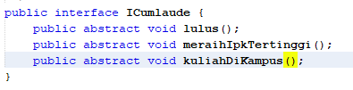
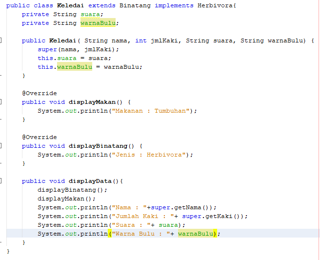

# PERCOBAAN 1
## OUTPUT PROGRAM
 

## PERTANYAAN
1.Pada langkah ke 9, pada baris program ke 3 terdapat warning pada script tersebut. Jelaskan penyebab terjadinya hal tersebut ?

Jawab : karena class interface ICumlaude yang berada pada satu package

2.Pada langkah ke 9, pada baris program ke 3. Apa yang terjadi jika script tersebut dihilangkan? 
Jelaskan menurut pemahaman anda.

Jawab : akan mengeluarkan build succesfull karena tidak ada intansiasi dari class-class yang dipanggil.

3.Mengapa pada langkah nomor 9 terjadi error? Jelaskan!

Jawab : Karena class mahasiswa bukan merupakan implementasi dari class interface ICumlaude.

4.Dapatkah method kuliahDiKampus() dipanggil dari objek sarjanaCumlaude di classProgram? Mengapa demikian?

Jawab : bisa, karena method kuliahDiKampus() berada pada class Mahasiswa dan method telah diwariskan pada class Sarjana.

5.Dapatkah method kuliahDiKampus() dipanggil dari parameter mahasiswa di method beriSertifikatCumlaude() pada class Rektor? Mengapa demikian?

Jawab : tidak bisa, Karena class Rektor bukan merupakan class turunan dari class Mahasiswa.

6.Modifikasilah method beriSertifikatCumlaude() pada class Rektor agar hasil eksekusi 
class Program menjadi seperti berikut ini:

Jawab : 

Menambahkan method abstract kuliahDiKampus() pada class ICumlaude

Memanggil method kuliahDiKampus()

## PERCOBAAN 2
## OUTPUT PROGRAM

## PERTANYAAN
1. Pada script code interface IBerprestasi, modifikasi script tersebut sesuai dengan gambar 
dibawah ini :(diubah menjadi protected)

Jawab : terjadi error karena tidak diperbolehan untuk menjadi protected,jika digunakan protected maka tidak bisa mengimplement ke class yang lain

2.Jelaskan menurut anda, mengapa hasil dari script code tersebut error ?

Jawab : karena classnya IBerprestasi adalah class interface jadi tidak bisa di instansisasi sama seperti class abstract.

3.Apabila Sarjana Berprestasi harus menjuarai kompetisi NASIONAL dan menerbitkan artikel di jurnal NASIONAL, maka modifikasilah class-class yang terkait 
pada aplikasi Anda agar di class Program objek pakRektor dapat memberikan sertifikat 
mawapres pada objek sarjanaCumlaude

Jawab : pertama menambahkan implements method pada class Sarjana dan Prasarjana yang sebelumnya pada class interface IBerprestasi sudah
ada method menjuaraiKompetisi dan MembuatPublikasiIlmiah dan diisi setiap method tersebut dengan value yang dinginkan

# Tugas
## Class Diagram

## Kode Program

## Class Karnivora

## Class Herbivora

## Class Binatang

## Class Singa

## Class Gorila

## Class Keledai

## Class MainProgram

## OutPut Program

