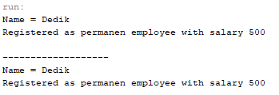
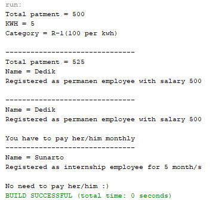

# Percobaan
## Percobaan 1
### Pertanyaan
1. Class apa sajakah yang merupakan turunan dari class Employee?

Jawaban : Class turunan dari class Employee adalah Class InternshipEmployee dan Class PermanentEmployee.

2. Class apa sajakah yang implements ke interface Payable?

Jawaban : Class yang menggimplement class Payable adalah Class PermanentEmployee dan Class ElectricityBill.

3. Perhatikan class Tester1, baris ke-10 dan 11. Mengapa e, bisa diisi dengan objek pEmp (merupakan objek dari class PermanentEmployee)
dan objek iEmp (merupakan objek dari class InternshipEmploye) ?

Jawaban : Karena kedua class tersebut merupakan class turunan dari class Employee.

4. Perhatikan class Tester1, baris ke-12 dan 13. Mengapa p, bisa diisi denganobjekpEmp (merupakan objek dari class
PermanentEmployee) dan objek eBill (merupakan objek dari class ElectricityBill) ?

Jawaban : Karena kedua class tersebut menggimplemen dari class Payable.

5. Coba tambahkan sintaks:
p = iEmp;
e = eBill;
pada baris 14 dan 15 (baris terakhir dalam method main) ! Apa yang menyebabkan error?

Jawaban : Karena objek iEmp (merupakan objek dari class InternshipEmploye) tidak menggimplement dari class Payable. 
Dan objek eBill (merupakan objek dari class ElectricityBill) bukan merupakan class turunan dari class Employee.

6. Ambil kesimpulan tentang konsep/bentuk dasar polimorfisme!

Jawaban : Kesimpulannya konsep dasar polimorfisme bisa ketika terjadi proses inheritance maupun interface.

## Percobaan 2

### Pertanyaan
1. Perhatikan class Tester2 di atas, mengapa pemanggilan e.getEmployeeInfo() pada baris 8 dan pEmp.getEmployeeInfo() pada baris 10 menghasilkan hasil sama?

Jawaban : Karena e (class Employee) telah dideklarasikan menjadi pEmp (class PermanentEmployee).

2. Mengapa pemanggilan method e.getEmployeeInfo() disebut sebagai pemanggilan method virtual (virtual method invication), sedangkan pEmp.getEmployeeInfo() tidak?

Jawaban : Karena e (class Employee) telah dideklarasikan menjadi pEmp (class PermanentEmployee). 
Dan pemanggilan method e.getEmployeeInfo() tidak lagi memanggil method getEmployeeInfo yang berada pada class Employee melainkan memanggil method getEmployeeInfo yang berada pada class PermanentEmployee.
Sedangkan untuk pEmp.getEmployeeInfo() langsung memanggil pada class PermanentEmployee.

3. Jadi apakah yang dimaksud dari virtual method invocation? Mengapa disebut virtual?

Jawaban : Virtual method invocation terjadi ketika ada pemanggilan overriding method dari suatu objek polimorfisme. Disebut virtual karena antara method yang dikenali
oleh compiler dan method yang dijalankan oleh JVM berbeda.

## Percobaan 3
### Pertanyaan
1. Perhatikan array e pada baris ke-8, mengapa ia bisa diisi dengan objekobjek dengan tipe yang berbeda, yaitu objek pEmp (objek dari PermanentEmployee) dan objek iEmp (objek dari InternshipEmployee) ?

Jawaban : Karena kedua objek tersebut adalah objek turunan dari objek Employee(e).

2. Perhatikan juga baris ke-9, mengapa array p juga biisi dengan objek-objek dengan tipe yang berbeda, yaitu objek pEmp (objek dari PermanentEmployee) dan objek eBill (objek dari ElectricityBilling) ?

Jawaban : Karena kedua objek tersebut adalah objek yang telah menggimplementasikan objek Payable(p).

3. Perhatikan baris ke-10, mengapa terjadi error?

Jawaban : Karena ada objek yang bukan merupakan objek turunan dari objek Employee yaitu objek ElectricityBill(eBill).

## Percobaan 4

 

### Pertanyaan
1. Perhatikan class Tester4 baris ke-7 dan baris ke-11, mengapa pemanggilan ow.pay(eBill) dan ow.pay(pEmp) bisa dilakukan, padahal jika diperhatikan method pay() yang ada di dalam class Owner memiliki argument/parameter bertipe Payable? Jika diperhatikan lebih detil eBill merupakan objek dari
ElectricityBill dan pEmp merupakan objek dariPermanentEmployee?

Jawaban : Karena kedua objek tersebut telah menggimplementasikan objek Payable.

2. Jadi apakah tujuan membuat argument bertipe Payable pada method pay() yang ada di dalam class Owner?

Jawaban : Untuk menentukan hanya objek yang telah menggimplemenkan objek Payable yang bisa menggunakan method pay() pada class Owner.

3. Coba pada baris terakhir method main() yang ada di dalam class Tester4 ditambahkan perintah ow.pay(iEmp);Mengapa terjadi error?

Jawaban : Terjadi error karena pada class InternshipEmploye tidak melakukan implementasi dari class Payable.

4. Perhatikan class Owner, diperlukan untuk apakah sintaks p instanceof ElectricityBill pada baris ke-6 ?

Jawaban : Untuk mengecek apakah objek ElectricityBill merupakan hasil instansiasi dari class Payable(p).

5. Perhatikan kembali class Owner baris ke-7, untuk apakah casting objek disana (ElectricityBill eb = (ElectricityBill) p) diperlukan ? Mengapa objek p yang bertipe Payable harus di-casting kedalam objek eb yang bertipe ElectricityBill ?

Jawaban : untuk mengubah tipe dari objek Payable(p) menjadi ElectricityBill(eb). Mengapa harus harus di-casting agar bisa menggakses/menggunakan method yang berada pada class ElectricityBill(eb).
