# Tugas 1
## Kode Program
### Class Pegawai

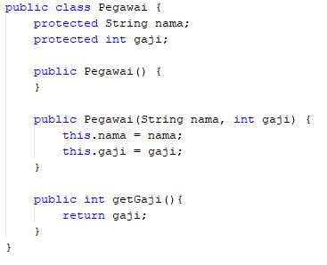

### Class Manager

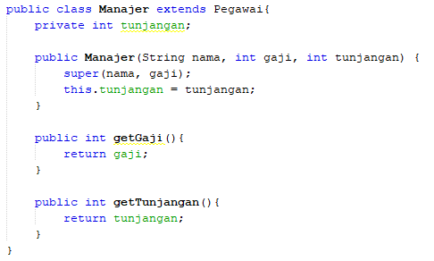

### Class Programmer

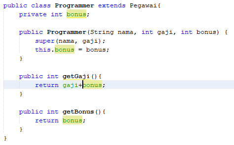

### Class Bayar

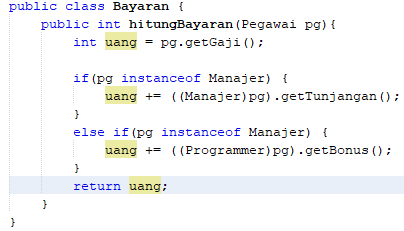

### Class TestBayar

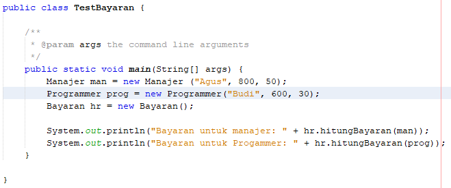

## Output Program

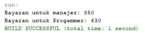

# Tugas 2
## Kode Program
### Class Elektronik

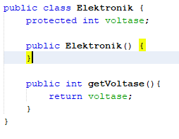

### Class TelevisiJadul

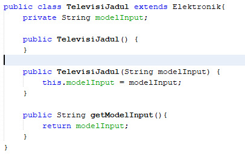

### Class TelevisiModern

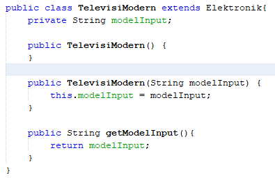

### Class Manusia

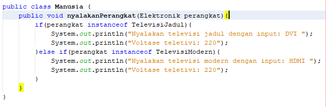

### Class TestElektonik

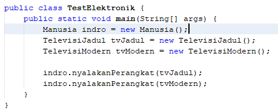

## Output Program

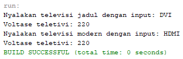
