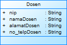
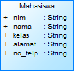
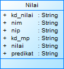

## Latihan 1
1.) ada 4 class yang bisa dibuat dari masalah tersebut yakni:class Dosen, Mahasiswa, MataPelajaran, dan Nilai
2.
## class Dosen
import java.util.*;

/** @pdOid 4f68ee6d-8148-4215-848c-08a932366a8e */
public class Dosen {
   /** @pdOid 6882fa01-7aff-45d2-9f59-b14a8fdb3c90 */
   public String nip;
   /** @pdOid d0811598-f444-407d-9499-a71f943c4533 */
   public String namaDosen;
   /** @pdOid 2a4edbab-7139-4bb4-96c6-cc1023ba3067 */
   public String alamatDosen;
   /** @pdOid 5e46b7ad-908f-4f7f-b13a-bd77df3d28a2 */
   public String no_telpDosen;

}
## class Diagram Dosen

## class Mahasaiswa
## class Diagram Mahasaiswa

## class Nilai
## class Diagram Nilai

## class Mata Kuliah
## class Diagram Mata Kuliah

