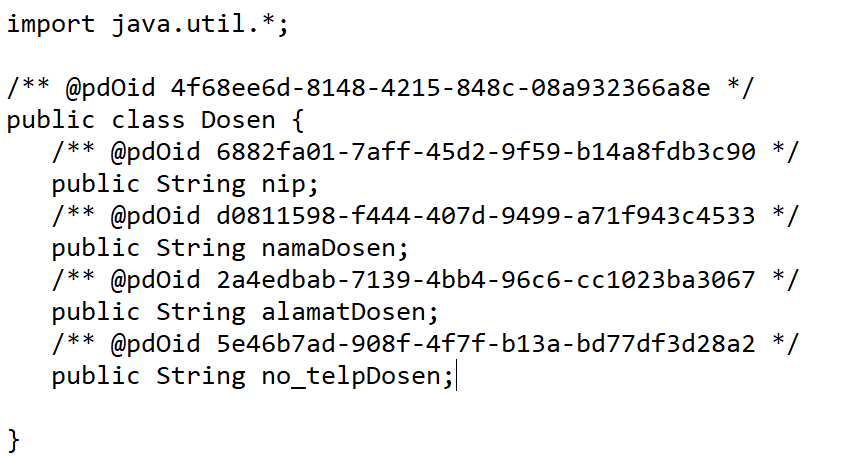
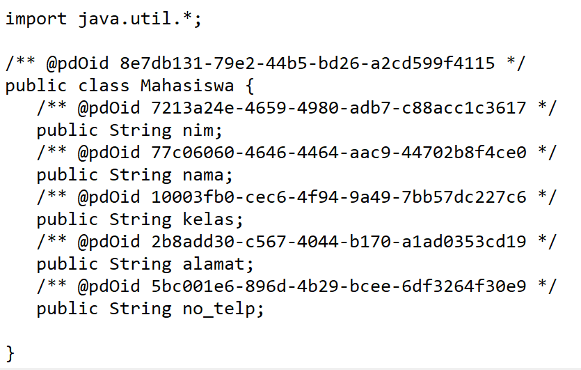
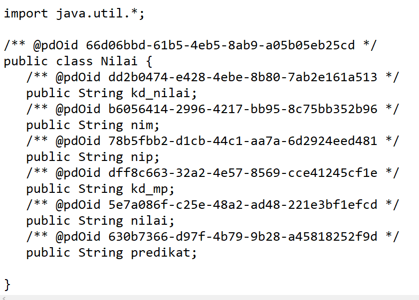
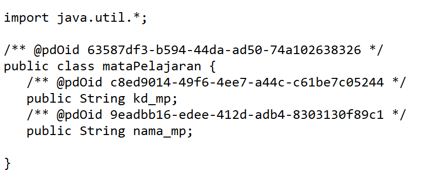

## Latihan 1
1.) ada 4 class yang bisa dibuat dari masalah tersebut yakni:class Dosen, Mahasiswa, MataPelajaran, dan Nilai
2.
## class Dosen

## class Diagram Dosen

## class Mahasaiswa

## class Diagram Mahasaiswa

## class Nilai

## class Diagram Nilai

## class Mata Kuliah

## class Diagram Mata Kuliah

