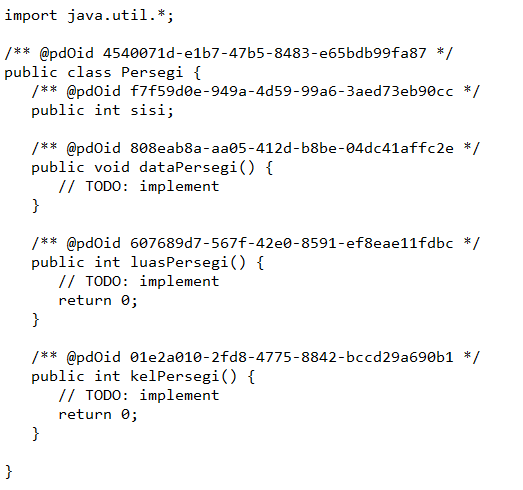
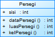
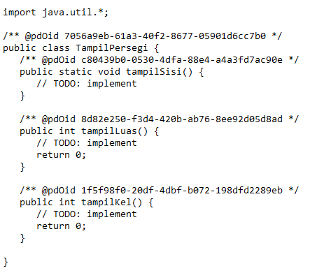
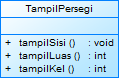

## Latihan 1
1.) ada 4 class yang bisa dibuat dari masalah tersebut yakni:class Dosen, Mahasiswa, MataPelajaran, dan Nilai
2.
## Class Dosen

## Class Diagram Dosen

## Class Mahasaiswa

## Class Diagram Mahasaiswa

## Class Nilai

## Class Diagram Nilai

## Class Mata Kuliah

## Class Diagram Mata Kuliah

## Latihan 2
## Class Diagram Dosen

## Class Diagram Mahasaiswa

## Class Diagram Nilai

## Class Diagram Mata Kuliah

## Latihan 3
## Class Persegi

## Class Diagram Persegi

## Class Tampil Persegi

## Class Diagram Tampil Persegi

