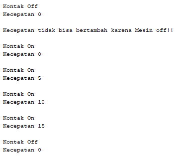

## 3.3 Pertanyaan
      1. Karena status dari kontakOn tidak true (atau mesin masih mati) sehingga kecepeatan tidak bisa bertambah.
      2. Karena hanya class tersebut saja yang bisa mengakses atribut kecepatan dan kontakOn.
      3. 
