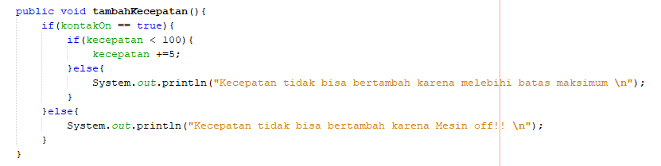

## 3.3 Pertanyaan

      1. Karena status dari kontakOn tidak true (atau mesin masih mati) sehingga kecepeatan tidak bisa bertambah.
      2. Karena hanya class tersebut saja yang bisa mengakses atribut kecepatan dan kontakOn.
      3. 

## 3.6 Pertanyaan – Percobaan 3 dan 4
     1. getter adalah method yang digunakan untuk menampilkan atau mengembalikan nilai.
	   setter adalah method yang digunakan untuk memberikan nilai pada suatu parameter.
     2. getSimpanan digunakan untuk menampilkan nilai data simpanan yang telah disimpan pada variabel simpanan.
     3. method yang digunakan untuk menambah saldo yaitu method setor.
     4. konstruktor adalah method khusus yang akan dieksekusi pada saat pembuatan objek (instance).
     5. aturan dalam membuat konstruktor yaitu:
            Suatu constructor dapat di overload
		Default constructor diberikan oleh compiler Java
		Default constructor tidak akan diberikan oleh compiler jika pada class tersebut sudah ada constructor
		Hanya compiler yang membuat default constructor
		Suatu constructor tidak dapat diwariskan (inherited)
		Suatu Constructor bisa memiliki acces modifer private
		Constructor default akan memiliki acces modifier yang sama dengan class-nya
		Constructor default dari superclass akan dipanggil oleh constructor subclass-nya
		super() atau this() adalah pernyataan pertama yang harus di panggil dalam constructor
	6. konstruktor boleh bertipe private.
	7. passsing parameter digunakan ketika pada konstruktor memiliki parameter.
	8. atribut class adalah atribut yang digunakan untuk membedakan dengan class lain biasanya digunakan untuk menyimpan data(variabel).
	   instansiasi atribut adalah cara untuk menentukan atribut yang ingin digunakan.
	9. method class adalah method yang digunakan untuk memproses atribut class.
	   instansiasi method adalah cara untuk menentukan method yang ingin digunakan.
	   

