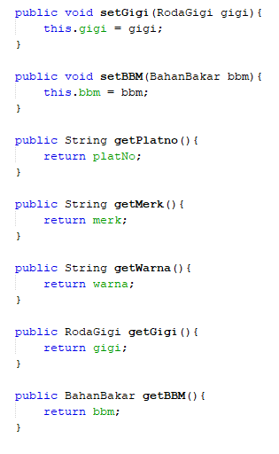
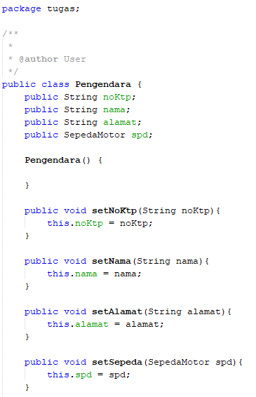

# Tugas
## Studi Kasus
Pada suatu perusaan transportasi ingin mengetahui berapa pengendara yang mengunakan sepeda motor dimana data yang diinginkan yaitu 
data diri pengendara, data sepeda motor, serta data informarsi dari sepeda motor tersebut seperti roda gigi dan bahan bakar sepeda motor.
Dari narasi tersebut buatkan Class Diagram dan implementasikan dalam bentuk program.
## Class Diagram 

## Kode Program 

### Roda Gigi

### Bahan Bakar

### Sepeda Motor

### Pengendara 

### MainClass

### Output Program

