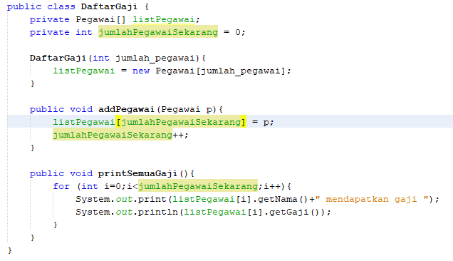
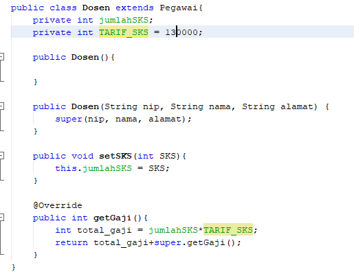
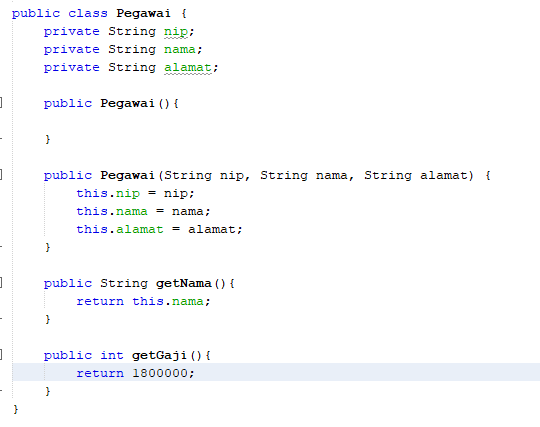
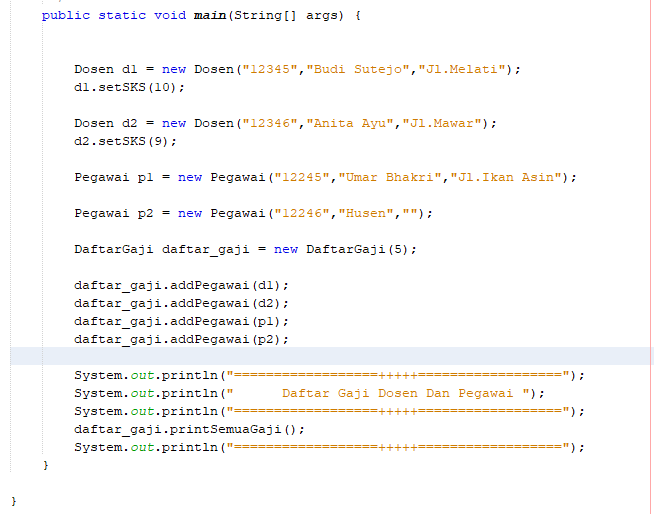

# Percobaan 
## Percobaan 1

1. Pada percobaan 1 diatas program yang dijalankan terjadi error, kemudian perbaiki sehingga
program tersebut bisa dijalankan dan tidak error!

*Jawaban :*

2. Jelaskan apa penyebab program pada percobaan 1 ketika dijalankan terdapat error!

*Jawaban*

Karena pada ClassB kurang menambahkan extends ClassA pada class tersebut agar bisa mengakses atribut public dari classA. 

## Percobaan 2
1. Pada percobaan 2 diatas program yang dijalankan terjadi error, kemudian perbaiki sehingga
program tersebut bisa dijalankan dan tidak error!

*Jawaban*

2. Jelaskan apa penyebab program pada percobaan 1 ketika dijalankan terdapat error!

*Jawaban*

Karena pada ClassB kurang menambahkan extends ClassA pada class tersebut agar bisa mengakses atribut dari classA. 

## Percobaan 3
1. Jelaskan fungsi “super” pada potongan program berikut di class Tabung!

*Jawaban*

Kata kunci super dipakai untuk merujuk pada member dari parent class yakni memangil atribut phi dan r yang berada pada parent classnya yaitu class bangun.
2. Jelaskan fungsi “super” dan “this” pada potongan program berikut di class Tabung!

*Jawaban*

Kata kunci super dipakai untuk merujuk pada member dari parent class yakni memangil atribut phi dan r yang berada pada parent classnya yaitu class Bangun.
Kata kunci this yang dipakai untuk merujuk pada member dari class itu sendiri yakni atribut t yang berada pada class Tabung tersebut. 

3. Jelaskan mengapa pada class Tabung tidak dideklarasikan atribut “phi” dan “r” tetapi class tersebut dapat mengakses atribut tersebut!

*Jawaban*

Karena pada class Tabung telah mewarisi atribut phi dan r dari class Bangun Sehingga tidak perlu deklarasi kembali hanya perlu mengaksesnya saja.

## Percobaan 4
1. Pada percobaan 4 sebutkan mana class yang termasuk superclass dan subclass, kemudian
jelaskan alasannya!

*Jawaban*

superclass : ClassA superclass dari ClassB dan ClassB superclass dari ClassC.

subclass : ClassB subclass dari ClassA dan ClassC subclass dari ClassB.

*Jawaban*

2.
3. urutan proses jalanya kontruktor tersebut yakni memanggil kontruktor parent classnya terlebih dahulu kemudian menampilkan isi dari kontruktor itu sendiri.
4. fungsi dari super() pada potongan tersebut adalah untuk memanggil kontruktor pada parent class.

# Tugas
## Class Daftar Gaji

## Class Dosen

## Class Pegawai

## Class Main Program

