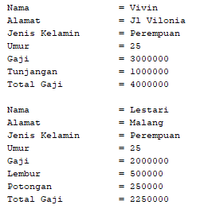

# Percobaan 1

## Pertanyaan
1. super class : Karyawan.
   sub class   : Staff dan Manager.
2. kata kunci yang digunakan untuk menurunkan suatu class ke class lain adalah extends
3. atribut yang dimiliki class manager adalah atribut tunjangan.

   atribut yang diwarisi dari class Karyawan adalah atribut nama, alamat, jk, umur, gaji.
4. kata super tersebut digunakan untuk memanggil atribut gaji pada super class atau class karyawan.
5. percobaan tersebut masuk kedalam jenis interitance Hierarchical Inheritance karena kelas kariawan memiliki lebih dari satu kelas turunan (subclass).
   
# Percobaan 2

## Pertanyaan
1. yang temasuk single inheritance adalah class Karyawan Manager dan class Staff StaffHarian.

   yang temasuk multilevel inheritance adalah class Karyawan Staff Dan StaffHarian.
   
2. atribut yang dimiliki class StaffTetap adalah golongan dan asuransi.

   atribut yang dimiliki class StaffHarian adalah jlmJamKerja.
   
   atribut yang diwarisi dari class Staff adalah lembur dan potongan serta atribut yang didapatkan class Staff dari class Karyawan.   
   
3. kode tersebut digunakan untuk memangil kontruktor dari class Staff dan menginputkan data menuju class Staff tersebut.
4. fungsi dari potongan kode program tersebut digunakan untuk memanggil method tampilDataStaff() yang berada pada class indunya yakni class Staff.
5. karena pada class StaffHarian telah mewarisi atribut dari class Staff sehingga pada class StaffHarian tidak perlu melakukan deklarasi lago dan hanya tingal mengakses atribut itu pada class Staff.

# Tugas
## Class Komputer

## Class leptop

## Class pc

## Class mac

## Class windows

## Class main class

## Output Program

