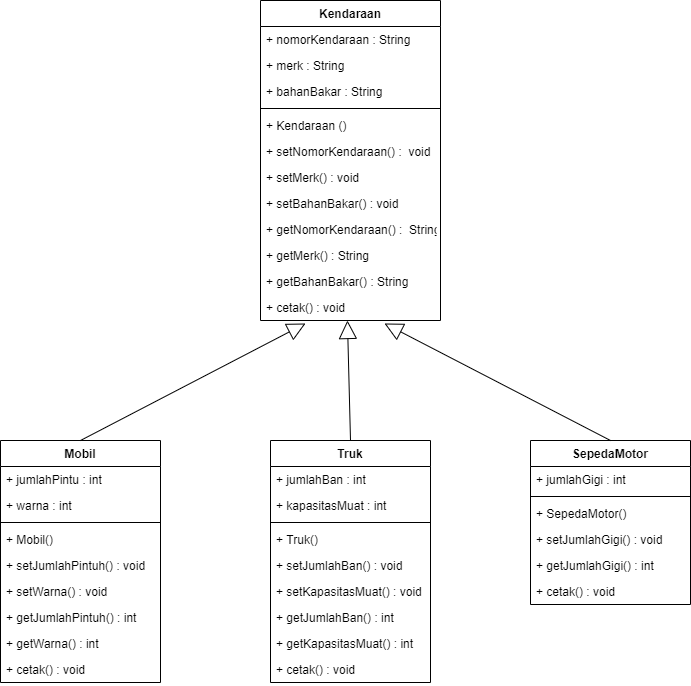
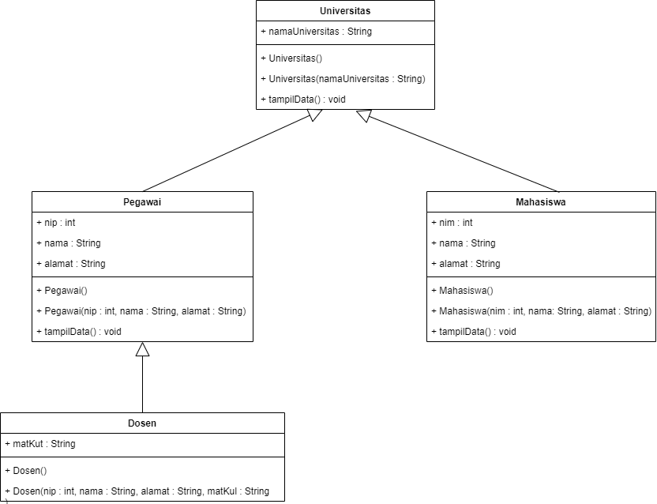

# Hierarchical Inheritance
## Study Kasus
Pada suatu perusahaan ingin melihat macam-macam kendaraan yang sering digunakan oleh masyarakat. Class yang diinginkan antara lain :
1. Class Kendaraan sebagai superclass yang memiliki atribut nomorKendaraan, merk dan bahanBakar.
2. Class Mobil sebagai subclass dari class Kendaraan yang memiliki atribut jumlahPintu dan warna.
3. Class Truk sebagai subclass dari class Kendaraan yang memiliki atribut jumlahBan dan kapasitasMuat.
4. Class SepedaMotor sebagai subclass dari class Kendaraan yang memiliki atribut jumlahGigi.
pada studi kasus diatas tolong buatkan class diagram beserta setter dan getternya.

## Class Diagram

# Hybrid Inheritance
## Study Kasus
Pada suatu Universitas ingin mengetahui data dari pegawai dan mahasiswa dalam universitas tersebut. Class yang diinginkan antara lain :
1. Class Universitas sebagai superclass yang memiliki atribut namaUniversitas.
2. Clas Pegawai sebagai subclass dari class Universitas dan sebagai superclass dari class Dosen yang memiliki atribut nip, nama, alamat.
3. Class Dosen sebagai subclass dari class Pegawai yang memiliki atribut matKul.
4. Class Mahasiswa sebagai subclass dari class Universitas yang memiliki atribut nim, nama, alamat.
pada studi kasus diatas tolong buatkan class diagram
## Class Diagram 

