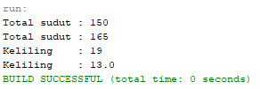
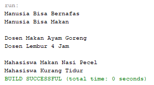

# Percobaan 1

# Latiha 1

## Pertanyaan
1. Pada source coding tersebut overloading terdapat pada pada method perkalian.
2. Ada 1 parameter yang berbeda yaitu pada class method perkalian yang kedua parameter int c.

# Latiha 2

## Pertanyaan
1. Pada source coding tersebut overloading terdapat pada pada method perkalian.
2. ada 2 tipe parameter yakni parameter dengan tipe data int dan double.

# Latiha 3

## Pertanyaan
1. Pada source coding tersebut overloading terdapat pada pada method swim.
2. Overriding pada source code tersebut adalah pada method swim yang digunakan pada cass Ikan dan class Piranha.

# Tugas 1
## Class Segitiga

## Class MainClass

# Output Program

# Tugas 2
## Class Manusia

## Class Dosen

## Class Mahasiswa

## Class MainClass

# Output Program

